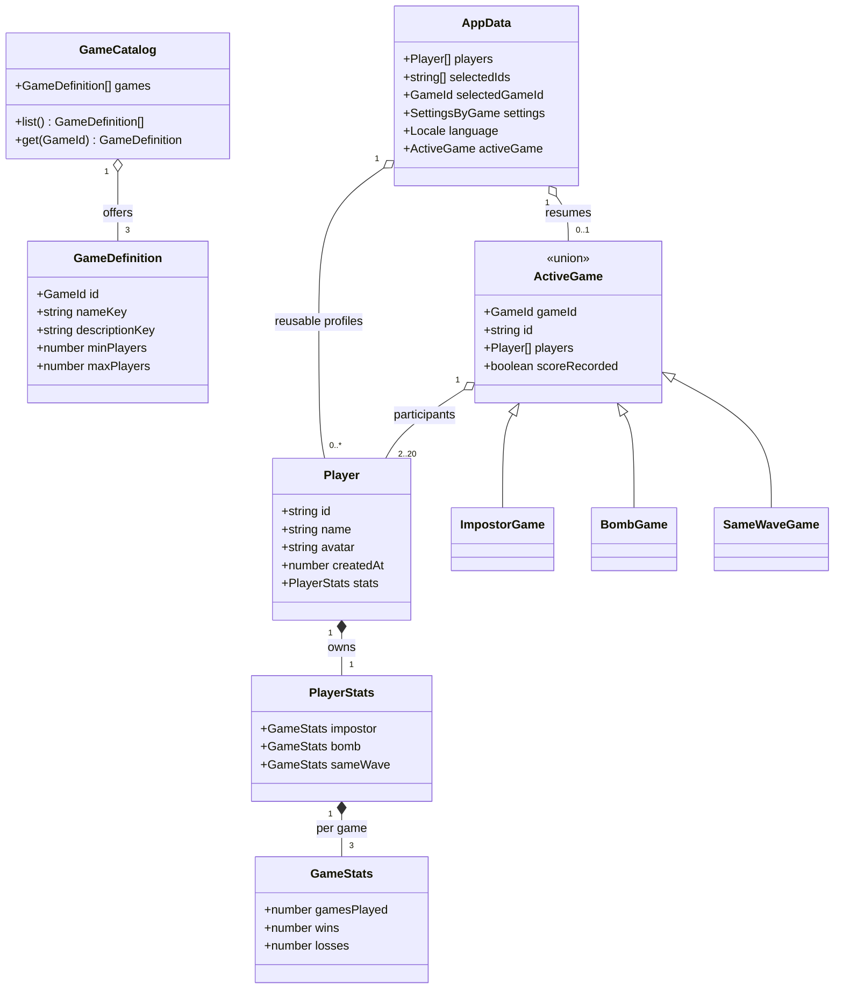

# Pocket Circle product design

Pocket Circle is a local-first catalog of pass-and-play party games. One phone is shared by friends; profiles, settings, sessions, and statistics stay in that browser. The app contains no advertising, analytics, accounts, or runtime network calls.

## Product structure

The landing screen is a game catalog. Each catalog entry has stable metadata, supported player limits, localized copy, and a setup renderer. Selecting an entry opens that game's setup while reusing the same saved player profiles. The header exposes a separate statistics page at `#stats`; returning to the catalog uses `#catalog`.

`GameCatalog` is the only registry of available games. It owns immutable `GameDefinition` values and resolves them by stable `GameId`. Runtime sessions are a discriminated `ActiveGame` union, so each game keeps only its own rules while persistence and rendering can exhaustively dispatch on `gameId`.

Profiles belong to `AppData`, not to any game. Every session snapshots participating profiles for stable names and avatars, while result recording updates canonical profiles by ID. Overall totals and win percentage are derived by summing three `GameStats` records; no duplicate aggregate counter is persisted.

## Catalog games

### Impostore

Existing hidden-role game remains behavior-compatible: 3–20 players, configurable impostor count and voting attempts, bilingual word categories, private reveal, discussion, progressive voting, and rematch. Existing citizen/impostor role counters remain available as an Impostore-specific breakdown in addition to generic wins and losses.

### Bomba

Two to twenty players choose a bilingual topic category such as tech companies. A round starts a common random timer between 20 and 45 seconds while app shows bomb and topic. Players say valid, unused answers aloud and manage turns themselves; app has no pass button, holder state, microphone, or answer validation. When timer expires, app opens group adjudication. Group selects player caught by explosion; selected player receives loss/negative result and every other participant wins. No statistic is recorded before selection. Reload resumes from persisted absolute deadline or adjudication screen. A rematch keeps players and topic selection but chooses new prompt and deadline.

Bomb content is data-driven. Each `BombPrompt` has stable ID, category ID, Italian/English topic, and bilingual examples used only as optional inspiration before round starts. Runtime never downloads content.

### Stessa Onda

Three to twenty players receive same light-hearted prompt with four localized choices. Phone passes privately; each player selects one answer without seeing earlier choices. Result groups players by answer. Every player in a largest group of at least two wins; tied largest groups all win. If every choice is unique, nobody wins. This creates a quick social compatibility game without moderator or subjective scoring.

Content is data-driven through stable bilingual `SameWavePrompt` records. A rematch keeps participants and selects a different prompt when possible.

## Statistics screen

`#stats` is a separate application screen, reachable from catalog and game setup when no session is active. It shows:

- catalog-wide games played, wins, losses, and win rate;
- one card per saved player with overall totals;
- per-game played/won/lost values for Impostore, Bomba, and Stessa Onda;
- Impostore role split for migrated and newly recorded results;
- empty states for new profiles and an entirely empty roster.

Each completed session records once using `scoreRecorded`. Abandoned sessions never affect statistics. Statistics remain editable through player editing only if all invariants hold: non-negative safe integers and wins plus losses equals games played for every game.

## Visual system: Night Arcade

Pocket Circle uses one visual language on every route and in every game. Catalog, setup, private reveal, live rounds, results, dialogs, and statistics must use the same tokens and component shapes. Individual games may change only illustration and a small identifying accent; they must never replace the page background, typography, navigation, or button system.

### Foundations

- Background: deep plum `#17121F`; raised surface `#211A2B`; interactive surface `#2A2135`.
- Text: warm white `#F8F5FB`; secondary text `#C8BED2`; muted text `#A89DB5`.
- Primary accent: electric lime `#D4F777`; dark text on lime `#202713`.
- Secondary accent: soft violet `#B9A7E8`. Coral `#FF7657` is reserved for danger, Bomba countdown urgency, and destructive confirmation.
- Borders use `#463952`. Focus rings use lime and remain visible on every background.
- Body text is at least `14px` on mobile; supporting metadata at least `12px`. Line height is at least `1.45`. No essential copy uses low-opacity text.
- Page width is fluid with a readable maximum. At `320px` and wider there is no horizontal page overflow.

### Components

- Header is one compact app bar. Brand mark and `Pocket Circle` wordmark stay readable; navigation uses 44×44 px icon buttons on narrow screens and icon plus label when space permits. Accessible names never depend on icons.
- Primary action is lime, solid, and unique per view. Secondary actions are dark raised surfaces with visible borders. Destructive actions use coral only where needed.
- Cards use the same surface, border, 18–24 px radius, and restrained shadow. Game art may be colorful but copy always sits on an opaque high-contrast surface, never directly on a busy image.
- Inputs, chips, player rows, stat tiles, live-game panels, and dialogs reuse shared surface/border/text tokens.
- Active game screens keep the normal dark shell. Impostore, Bomba, and Stessa Onda do not introduce full-screen red, orange, or unrelated palettes.
- Motion is short and functional; `prefers-reduced-motion` disables decorative animation.

### Contextual help

The header help action is contextual, never an Impostore-only global dialog:

- catalog: explains Pocket Circle, shared local profiles, pass-and-play flow, privacy, and how to choose a game;
- game setup, live round, and result: explains rules and scoring for the selected or active game (`Impostore`, `Bomba`, or `Stessa Onda`);
- statistics: explains catalog-wide totals, per-game rows, win/loss meaning, and local-only storage.

Every help variant is complete in Italian and English, has a context-specific title and accessible dialog name, and may be opened or closed without altering the route or game state.

### Game identity within the system

- Impostore: violet identifier.
- Bomba: coral identifier, limited to bomb graphic and urgent state.
- Stessa Onda: cyan-violet identifier.

These identifiers may decorate an eyebrow, icon, or card edge. Lime remains global action/focus color. This section is normative: future UI changes extend these rules instead of adding another visual theme.

## Compatibility and non-goals

- Existing IndexedDB snapshots migrate in memory: current counters become Impostore statistics, current settings become Impostore settings, and current active games receive `gameId: "impostor"`.
- Physical database name, store, and key stay unchanged to preserve installed data despite new brand.
- GitHub Pages base path stays `/ImpostorGame/` until repository itself is renamed.
- No backend, multiplayer networking, cloud sync, speech recognition, answer validation, user accounts, ads, analytics, or install-time content download.
- Desktop and mobile browsers use same responsive UI; primary QA viewports remain 390 × 844 and 320 × 740.
