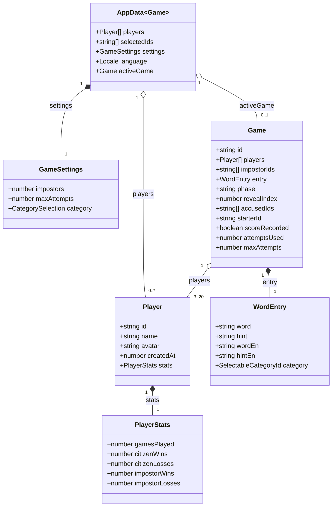

# IndexedDB persistence

## Physical database

| Element | Value |
| --- | --- |
| Database name | `impostor-game` |
| Version | `1` |
| Object store | `snapshot` |
| Snapshot key | `current` |
| Operations | `get("current")` for reads, `put(data, "current")` for writes, `delete("current")` for invalid snapshots |

The database is opened only in the browser. During `onupgradeneeded`, `snapshot` is created if it does not exist; each transaction closes the connection when it finishes. Open, blocked, read, and write errors are propagated to the interface. If a write cannot be cloned, the transaction is aborted to preserve the previous snapshot.

## Logical model

`AppData<Game>` is the complete snapshot written under the `current` key. `activeGame` may be `null`; when it contains a game, it allows the game to resume after a reload. `GameSettings.maxAttempts` configures full voting attempts. It is constrained to 1 through `players - impostors`; `Game.attemptsUsed` tracks completed votes and `Game.maxAttempts` snapshots the setting for the active round. `PlayerStats` stores games played plus wins/losses by role. Total wins, losses, role totals, and win percentage are derived for display. `Game.scoreRecorded` prevents a result from being counted twice after re-renders, reloads, or edits. `Game` has no locale field: the current `AppData.language` localizes its bilingual `WordEntry` at render time. The temporary flag that indicates whether a card is exposed is not part of this model and is not persisted.

`loadData()` validates the current snapshot shape on read. Existing players without `stats` are accepted and normalized to zero counters; existing settings without `maxAttempts` receive the maximum valid value for their saved selection. New writes always include complete stats and attempt settings. Invalid snapshots, including old category-label values, invalid category arrays, malformed stats, or out-of-range attempt settings, are deleted and treated as absent. No IndexedDB version bump is needed because the stored value is a single application snapshot and compatibility normalization happens at the snapshot boundary.

## Data scope

The data is local-only: it stays in the page origin's IndexedDB and is not synchronized with a server or remote database. Clearing site data deletes saved players, settings, and the active game. Availability depends on the browser's IndexedDB support and permissions.
