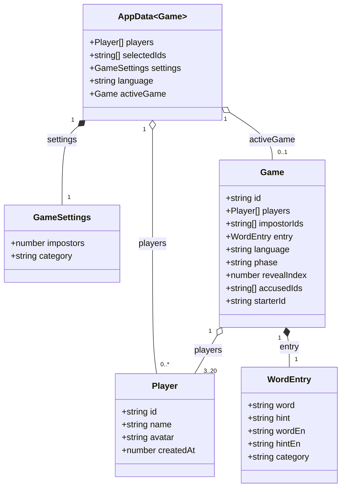

# IndexedDB persistence

## Physical database

| Element | Value |
| --- | --- |
| Database name | `impostor-game` |
| Version | `1` |
| Object store | `snapshot` |
| Snapshot key | `current` |
| Operations | `get("current")` for reads, `put(data, "current")` for writes |

The database is opened only in the browser. During `onupgradeneeded`, `snapshot` is created if it does not exist; each transaction closes the connection when it finishes. Open, blocked, read, and write errors are propagated to the interface. If a write cannot be cloned, the transaction is aborted to preserve the previous snapshot.

## Logical model

`AppData<Game>` is the complete snapshot written under the `current` key. `activeGame` may be `null`; when it contains a game, it allows the game to resume after a reload. The temporary flag that indicates whether a card is exposed is not part of this model and is not persisted.

## Data scope

The data is local-only: it stays in the page origin's IndexedDB and is not synchronized with a server or remote database. Clearing site data deletes saved players, settings, and the active game. Availability depends on the browser's IndexedDB support and permissions.
