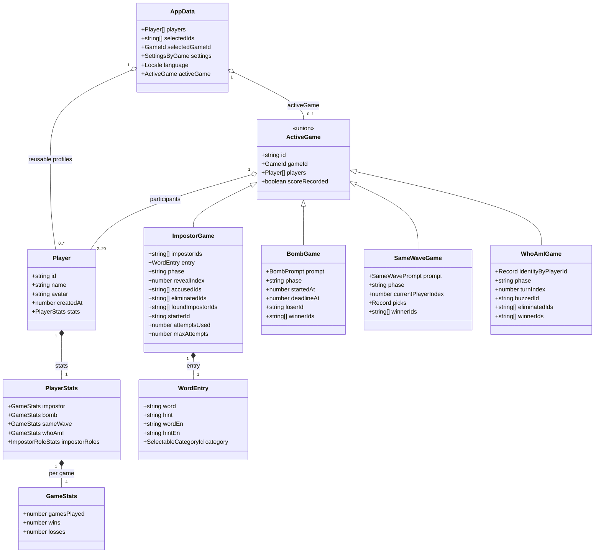

# IndexedDB persistence

## Physical database

| Element | Value |
| --- | --- |
| Database name | `impostor-game` (legacy technical identifier retained for data compatibility) |
| Version | `1` |
| Object store | `snapshot` |
| Snapshot key | `current` |
| Operations | `get("current")` for reads, `put(data, "current")` for writes, `delete("current")` for invalid snapshots |

The database is opened only in the browser. During `onupgradeneeded`, `snapshot` is created if it does not exist; each transaction closes the connection when it finishes. Open, blocked, read, and write errors are propagated to the interface. If a write cannot be cloned, the transaction is aborted to preserve the previous snapshot.

## Target logical model

`AppData` is the complete snapshot written under `current`. `activeGame` may be `null`; its `gameId` selects one union member and allows exact resume after reload. Every session carries `scoreRecorded`, preventing duplicate updates after re-renders or reloads. Bomb uses an absolute deadline so elapsed time survives reload without persisting a timer handle; expiry opens adjudication and loser/winners remain empty until group selection. Player totals are derived from per-game records. Impostore retains its role breakdown. Locale and transient reveal flags remain outside individual game records.

`loadData()` validates and migrates snapshots at boundary. Legacy counters become Impostore statistics; legacy settings become `settings.impostor`; legacy active games gain `gameId: "impostor"`; selected game defaults to Impostore. Snapshots predating Chi sono? gain zero counters and default settings. New writes use only target shape. Malformed or unsupported snapshots are deleted and treated as absent. No IndexedDB version bump is needed because compatibility normalization operates on single stored snapshot value.

Saved game content is validated structurally and remains independent of later editorial changes to catalog. Missing supported Impostore attempt settings default to minimum rather than becoming `NaN`. Impostore wins and losses must match role-specific sums. Stessa Onda picks must match player progress and computed winners. Chi sono? requires one unique bilingual identity per player plus phase-consistent current turn, buzz, eliminations, and winner.

## Data scope

The data is local-only: it stays in the page origin's IndexedDB and is not synchronized with a server or remote database. Clearing site data deletes saved players, settings, and the active game. Availability depends on the browser's IndexedDB support and permissions.
